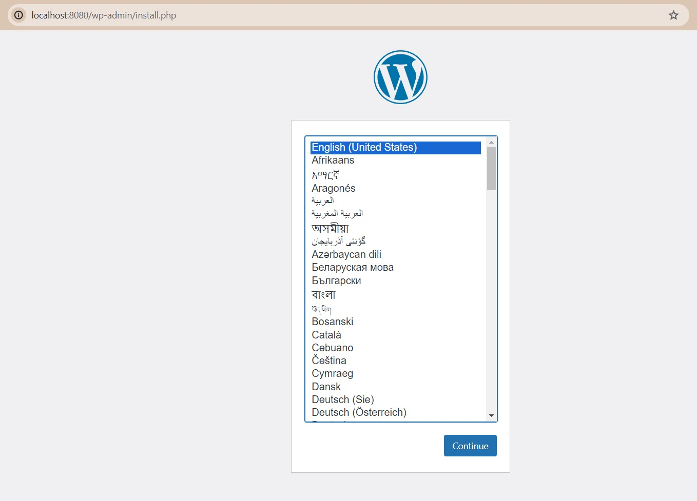

# MyDockerPress

MyDockerPress est un projet qui vous permet de déployer facilement et rapidement un site WordPress avec une base de données MySQL en utilisant Docker. Avec MyDockerPress, vous n'avez pas besoin de vous soucier de l'installation et de la configuration de WordPress et de MySQL sur votre machine. Vous pouvez simplement utiliser Docker Compose pour créer et exécuter les conteneurs nécessaires en quelques minutes.

## Fonctionnalités

- Un site WordPress prêt à l'emploi avec un thème et des plugins personnalisables.
- Une base de données MySQL sécurisée et persistante pour stocker les données du site WordPress.
- Une configuration simple et flexible avec un fichier `.env` pour définir les variables d'environnement.
- Une gestion facile des conteneurs Docker avec Docker Compose.

## Technologies

- Docker : un logiciel qui permet de créer et de gérer des conteneurs isolés qui peuvent exécuter des applications.
- Docker Compose : un outil qui permet de définir et d'exécuter des applications multi-conteneurs avec Docker.
- WordPress : un système de gestion de contenu (CMS) qui permet de créer et de gérer facilement des sites web.
- MySQL : un système de gestion de base de données relationnelle (SGBDR) qui permet de stocker et de manipuler des données.

## Prérequis

- Niveau requis en Docker : [Débutant/Intermédiaire/Avancé] Connaissance de base de Docker et Docker Compose.
- Docker version 20.10.0 ou supérieure et Docker Compose version 1.27.0 ou supérieure installés sur votre machine. Si vous n'avez pas Docker, vous pouvez le télécharger et l'installer [ici](https://www.docker.com/get-started).

### Installation de Docker Desktop

- **Windows :** [Télécharger Docker Desktop](https://desktop.docker.com/win/main/amd64/Docker%20Desktop%20Installer.exe).

- **Mac :** [Installer Docker Desktop pour Mac](https://docs.docker.com/desktop/install/mac-install/)

### Installation de Docker en ligne de commande

- **Linux :**
  ```bash
  sudo apt-get update
  sudo apt-get install docker-ce docker-ce-cli containerd.io
  ```

## Installation

1. Clonez ce dépôt. [ici](https://github.com/Monsieur9Bre99/MyDockerPress.git)
2. Créez un fichier `.env` dans le répertoire racine du projet. Ce fichier doit définir les variables d'environnement nécessaires pour configurer WordPress et MySQL. Voici un exemple de contenu pour le fichier `.env` :

    ```env
    WORDPRESS_DB_HOST=db
    WORDPRESS_DB_USER=your_wordpress_user
    WORDPRESS_DB_PASSWORD=your_wordpress_password
    WORDPRESS_DB_NAME=your_wordpress_db_name

    MYSQL_ROOT_PASSWORD=your_mysql_root_password
    MYSQL_DATABASE=your_mysql_database
    MYSQL_USER=your_mysql_user
    MYSQL_PASSWORD=your_mysql_password
    ```

    Remplacez `your_wordpress_user`, `your_wordpress_password`, `your_wordpress_db_name`, `your_mysql_root_password`, `your_mysql_database`, `your_mysql_user`, et `your_mysql_password` par vos propres valeurs.

3. Exécutez `docker-compose up` pour démarrer les conteneurs Docker.

## Utilisation

Ouvrez votre navigateur et accédez à `http://localhost:8080` pour voir votre site WordPress.



## Arrêt et suppression des conteneurs

Pour arrêter les conteneurs Docker, appuyez sur `Ctrl+C` dans le terminal où vous avez exécuté `docker-compose up`.

Pour supprimer les conteneurs Docker, exécutez `docker-compose down`.

## Ressources

- [Documentation officielle de Docker](https://docs.docker.com/)
- [Documentation officielle de Docker Compose](https://docs.docker.com/compose/)
- [Documentation officielle de WordPress](https://wordpress.org/support/documentation/)
- [Documentation officielle de MySQL](https://dev.mysql.com/doc/)


© breroot 2023 - MIT Licence
```